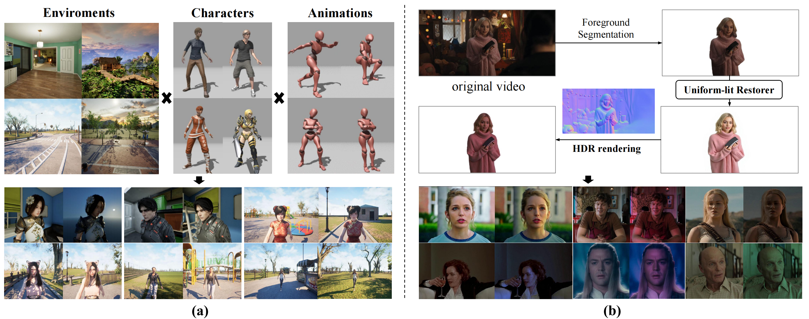
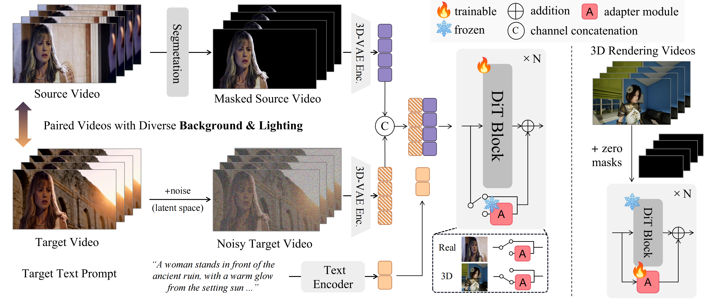

<div align="center">
  
</div>

## 💡Lumen: Consistent Video Relighting and Harmonious Background Replacement with Video Generative Models

Jianshu Zeng<sup>1,3*</sup>, Yuxuan Liu<sup>2*</sup>, Yutong Feng<sup>2†</sup>, Chenxuan Miao<sup>4</sup>, Zixiang Gao<sup>1</sup>, Jiwang Qu<sup>5</sup>, Jianzhang Zhang<sup>5</sup>, Bin Wang<sup>2</sup>, Kun Yuan<sup>1‡</sup>
<br>
<sup>1</sup>Peking University, <sup>2</sup>Kunbyte AI, <sup>3</sup>University of Chinese Academy of Sciences, <sup>4</sup>Zhejiang University, <sup>5</sup>Hangzhou Normal University
<br>
<sup>*</sup>Equal Contribution, <sup>†</sup>Project Leader, <sup>‡</sup>Corresponding Author

[](https://lumen-relight.github.io)
[](https://arxiv.org/abs/2508.12945)
[](https://github.com/Kunbyte-AI/Lumen)
[](https://huggingface.co/Kunbyte/Lumen)
[](https://huggingface.co/spaces/Kunbyte/Lumen)

## 🔍 Introduction

✈️✈️ See Our [Project Page](https://lumen-relight.github.io) for more demonstration. 

### Abstract
Video relighting is a challenging yet valuable task, aiming to replace the background in videos while correspondingly adjusting the lighting in the foreground with harmonious blending. During translation, it is essential to preserve the original properties of the foreground, e.g. albedo, and propagate consistent relighting among temporal frames. While previous research mainly relies on 3D simulation, recent works leverage the generalization ability of diffusion generative models to achieve a learnable relighting of images.
<br>
In this paper, we propose **Lumen**, an end-to-end video relighting framework developed on large-scale video generative models, receiving flexible textual description for instructing the control of lighting and background. Considering the scarcity of high-qualified paired videos with the same foreground in various lighting conditions, we construct a **large-scale dataset** with a mixture of realistic and synthetic videos. For the synthetic domain, benefiting from the abundant 3D assets in the community, we leverage advanced 3D rendering engine to curate video pairs in diverse environments. For the realistic domain, we adapt a HDR-based lighting simulation to complement the lack of paired in-the-wild videos.
<br>
Powered by the aforementioned dataset, we design a **joint training curriculum** to effectively unleash the strengths of each domain, i.e., the physical consistency in synthetic videos, and the generalized domain distribution in realistic videos. To implement this, we inject a domain-aware adapter into the model to decouple the learning of relighting and domain appearance distribution. We construct a **comprehensive benchmark** to evaluate Lumen together with existing methods, from the perspectives of foreground preservation and video consistency assessment. Experimental results demonstrate that Lumen effectively edit the input into cinematic relighted videos with consistent lighting and strict foreground preservation.

### Data Preparation

**The data preparation and examples of two domains.** (a) The 3D rendered data combines various environments, characters and animations to form paired videos with aligned foreground. (b) The realistic videos are transformed into uniform-lit appearance and rendered with HDR-based relighting.

### Framework

**The framework of Lumen**, which is developed on a video generative model in DiT architecture. The model consumes the concatenation of noisy tokens and the masked input video. An adapter module is injected into the backbone to decouple the style distribution in 3D paired videos.


## 🚀 Quick Start

### Environment
```
conda create -n lumen python=3.10 -y
conda activate lumen
pip install torch==2.4.0 torchvision==0.19.0 --index-url https://download.pytorch.org/whl/cu124
pip install -r requirements.txt
```
### Models
We use the [Wan2.1-Fun-1.3B-Control](https://huggingface.co/alibaba-pai/Wan2.1-Fun-1.3B-Control) from [VideoX-Fun](https://github.com/aigc-apps/VideoX-Fun) as our base model, which is based on the [Wan2.1](https://github.com/Wan-Video/Wan2.1). The main difference of the model structure of the DiT between Wan2.1-Fun and Wan2.1 is that Wan2.1-Fun extends the channel dimension of the latent space from 16 to 36(Wan2.1-Fun-Inp) or 48(Wan2.1-Fun-Control), so that it can concatenate the condition video and the origin video at channel dimension as input and then generate the result video based on the text.

You can download the weights of Lumen at [Kunbyte/Lumen](https://huggingface.co/Kunbyte/Lumen).

```
modelscope download --model 'PAI/Wan2.1-Fun-1.3B-Control' --local_dir 'ckpt/Wan2.1-Fun-1.3B-Control'
or
huggingface-cli download alibaba-pai/Wan2.1-Fun-1.3B-Control --local-dir ckpt/Wan2.1-Fun-1.3B-Control

[optional] modelscope download --model 'PAI/Wan2.1-Fun-14B-Control' --local_dir './Wan2.1-Fun-14B-Control' --exclude 'Wan2.1_VAE*' 'models_t5*' 'models_clip*'


```


The checkpoint directory is shown below.
```
Lumen/
└── ckpt/
    ├── Wan2.1-Fun-1.3B-Control
        ├── diffusion_pytorch_model.safetensors
        ├── Wan2.1_VAE.pth
        ├── models_t5_umt5-xxl-enc-bf16.pth
        ├── models_clip_open-clip-xlm-roberta-large-vit-huge-14.pth
            ...
    ├── Wan2.1-Fun-14B-Control
        └── diffusion_pytorch_model.safetensors
    ├── Lumen
        ├── Lumen-T2V-1.3B-V1.0.ckpt
    

```

### Inference

```
python app_lumen.py
python infer_t2v.py
```


## ✅ TODOs

- [x] [2025.8.20] release paper, project page, inference code, models(Lumen-T2V-1.3B-V1.0)
- [ ] release models: Lumen-T2V-14B-Lora, Lumen-I2V-1.3B/14B-Lora (soon)
- [ ] release training code and training data


## 📋 Citation
if you find our work helpful, please consider citing:
```
@article{zeng2025lumen,
    title={Lumen: Consistent Video Relighting and Harmonious Background Replacement with Video Generative Models},
    author={Zeng, Jianshu and Liu, Yuxuan and Feng, Yutong and Miao, Chenxuan and Gao, Zixiang and Qu, Jiwang and Zhang, Jianzhang and Wang, Bin and Yuan, Kun},
    journal={arXiv preprint arXiv:},
    year={2025},
    url={https://arxiv.org/abs/2508.12945}, 
}
```

## Acknowledgements
We would like to thank the contributors to the [DiffSynth-Studio](https://github.com/modelscope/DiffSynth-Studio), [VideoX-Fun](https://github.com/aigc-apps/VideoX-Fun), etc. for their open research and exploration.
